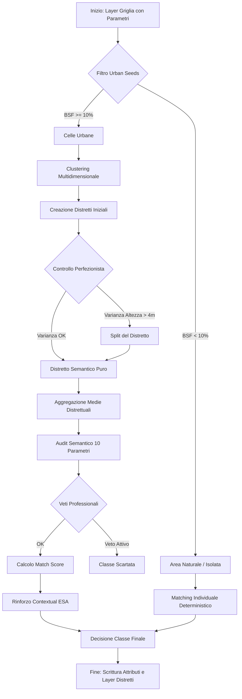

# Workflow Procedurale: Come "si muove" il Classificatore v8

Questo report descrive graficamente e analiticamente il flusso logico del classificatore **v8 (Semantic Expert Engine)**, evidenziando le decisioni prese ad ogni fase del ciclo.

---

## 1. Schema del Flusso Logico (Workflow)

---

## 2. Analisi delle Fasi di "Movimento"

### Fase A-B: Il Setaccio Iniziale
L'algoritmo non tratta tutte le celle allo stesso modo. Il primo "movimento" è una separazione netta:
-   Le celle con **BSF < 10%** vengono messe da parte per essere processate individualmente come aree naturali o isolate.
-   Le celle con **BSF $\ge$ 10%** diventano i "semi" per la costruzione della città.

### Fase E-I: La Danza del Clustering
Qui l'algoritmo "si muove" nello spazio e nella morfologia. Non guarda solo dove si trova una cella, ma quanto "assomiglia" alle vicine in termini di altezza e densità.
-   **Aggregazione**: Crea delle macro-aree (Distretti).
-   **Rifinitura (Perfezionismo)**: Se il distretto è troppo "confuso" (es. bordi di quartieri diversi), l'algoritmo lo spezza chirurgicamente per isolare aree con altezza omogenea.

### Fase K-N: L'Audit del Perito 
Per ogni distretto, l'algoritmo effettua un ciclo di controlli su **10 dimensioni**. 
-   **Cosa succede a ogni ciclo?** L'algoritmo prende la media dei parametri del distretto (es. quanto è alto in media, quanto è impermeabile) e lo confronta con la "scatola" (range) definita da Stewart & Oke. 
-   **Esempio di scelta**: Se il distretto ha un'altezza di 15m e una densità del 50%, l'algoritmo dirà: *"Questo rientra nel range della LCZ 2 (Compact Midrise)? Sì. Rientra nella LCZ 5 (Open Midrise)? No, la densità è troppo alta."*

### Fase O: L'Ancoraggio ESA
In questa fase l'algoritmo "chiede conferma" al dataset globale ESA WorldCover. 
- Se l'algoritmo ha deciso che un distretto è "Dense Trees" (LCZ A) e ESA dice che quel pixel è effettivamente foresta, scatta il **bonus di confidenza**. Questo stabilizza enormemente i confini tra città e natura.

---

## 3. Con che criterio prende le scelte?

L'algoritmo usa un **Criterio di Massima Verosimiglianza Semantica**:
1.  **Eliminazione**: Scarta le classi impossibili tramite i **Veti** (es. "Non può essere acqua se c'è troppo asfalto").
2.  **Punteggio**: Conta quanti parametri (da 1 a 10) cadono nel range ideale.
3.  **Spiegazione**: Per ogni scelta, l'algoritmo non scrive solo un numero, ma "spiega" perché ha scelto quella classe (es. *"7/10 parametri OK. Divergenze: SVF troppo alto"*).

## 4. Dove prende i dati?

| Tipo Dato | Fonte | Utilizzo |
| :--- | :--- | :--- |
| **Morfologia** | DTM/Buildings | Altezza, SVF, Densità |
| **Superficie** | Copernicus HRL | Asfalto (ISF), Vegetazione (PSF) |
| **Ottica** | Sentinel-2 | Riflettenza (Albedo) per distinguere materiali |
| **Controllo** | ESA WorldCover | Validazione finale della classe "naturale" |

---

> [!TIP]
> Il movimento più importante della v8 è il passaggio da **"Pixel -> Classe"** a **"Contesto -> Distretto -> Classe"**. Questo elimina l'effetto "sale e pepe" (pixel isolati classificati male) tipico delle versioni precedenti.
